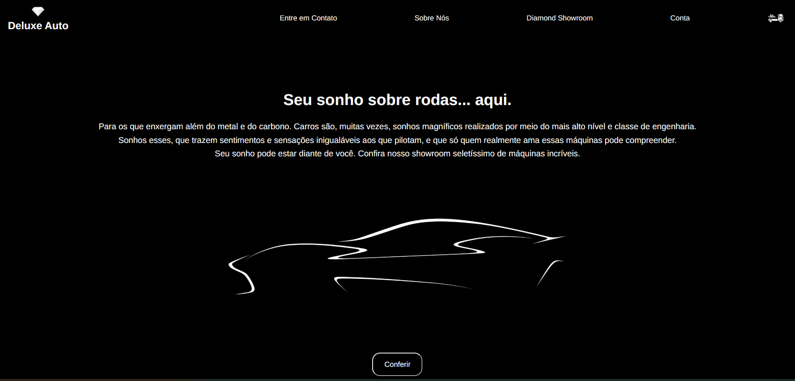
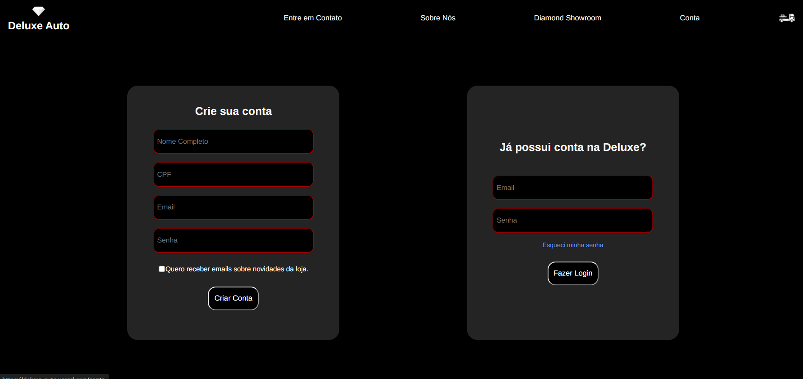
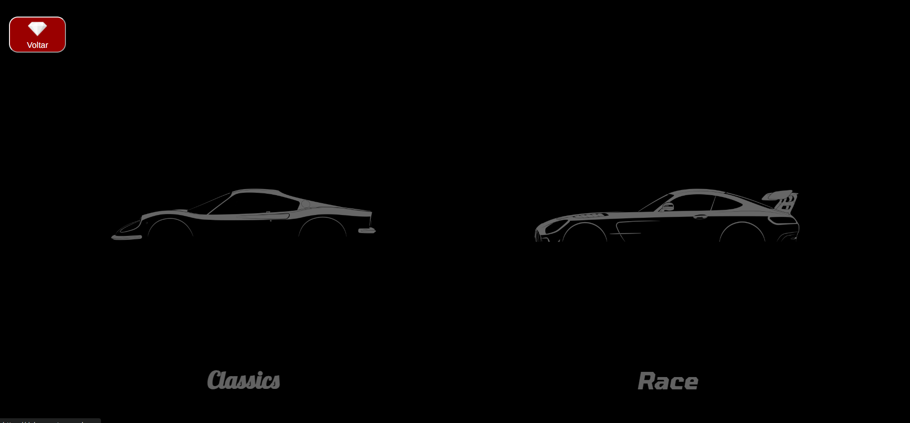
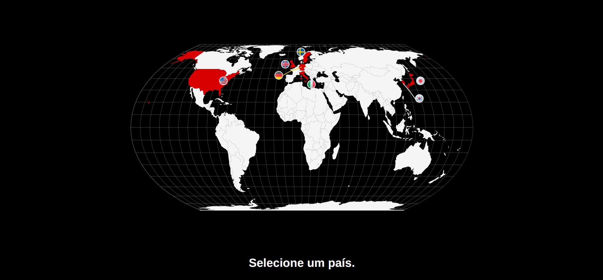
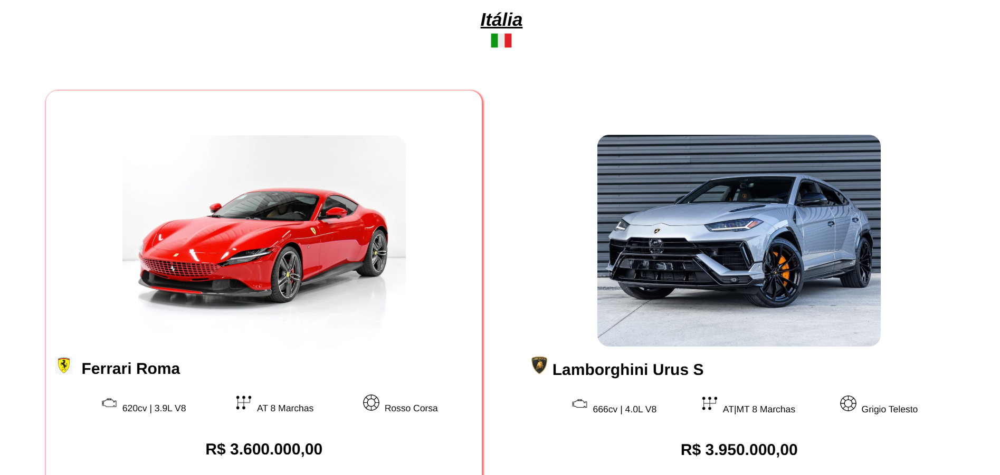

<br/>

<div class="titulo" align="center">
    
    <h1>Deluxe Auto</h1>
    <br/>
    <p>Onde o luxo e a excelência automotiva se encontram.</p>    
</div>

<br/>
<br/>

### ⁉️ O que é?
A **Deluxe Auto** é um site fictício, criado por mim ([gabriellima-4](https://github.com/gabriellima-4)), como projeto final da Oficina de React do CEUB (2024.2).

Consiste em uma loja online de carros de luxo de diversos tipos, sejam SUVs ou super-esportivos modernos, além de carros clássicos e carros de corrida.
<h2></h2>

<br/>

### 🌐 Países com modelos disponíveis na loja:
,
,
,

e mais...

<br/>

### 📸 Screenshots
<p>
    
    
    
</p>

<p>
    
    
    
</p>


<br/>

### ⚒️ Arquitetura
A arquitetura do projeto está distribuída da seguinte forma:

```
deluxeAuto/
|
|── src/                  # Aplicação React.js
|   |──── assets/         # Arquivos Estáticos
|   |──── components/     # Componentes React
|   |──── router/         # Todas as Rotas do site
|   |──── views/          # As Páginas do site
|   |
|   |──── index.css
|   |──── main.jsx
|
└──── ...
```

<br/>

### 🧑‍💻 Tecnologias Utilizadas


<br/>

#### Bibliotecas adicionais utilizadas:
<ul>
    <li><a href="https://www.react-simple-maps.io/">React-Simple-Maps</a></li>
</ul>

<br/>

#### Deployment feito com:


<br/>
<br/>
<br/>


<div align="center">
    <h2></h2>
    <h5>Desenvolvido por Gabriel Lima</h5>
</div>